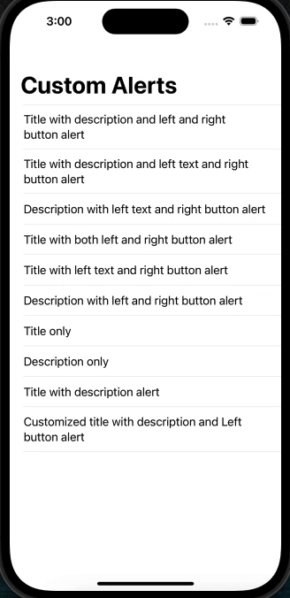

# SwiftUI-Custom-Alerts-View

This is a simple IOS SwiftUI application that demonstrates how to integrate custom alerts in your swiftUI projects.

## Table of Contents 

- [Demo UI](#demo)
- [Features](#features)
- [Usage](#usage)
- [Installation](#installation)
- [Contributing](#contributing)
- [Need Help / Support?](#need-help)
- [Collection of Components](#collection-of-Components)
- [License](#license)
- [Acknowledgements](#acknowledgements)
- [Keywords](#keywords)

# Demo UI 📱





# Features 🥳

App has main feature as:

* User can configure title, message and buttons as per need.
* User can configure font and text colour of alert view.
* User can place single button either right or centre horizontally as well.
* Fully customization available.
* Not any third party dependency.
* Easy to integrate with SwiftUI apps
* Support latest iOS 17.0

# Usage 👩🏾‍🔬

To display alert in your project, follow these steps:

Open your `ContentView` file to add the following code of line like:


```swift
ZStack{
    if isActive {
        CustomAlertView(isActive: $isActive, config: configWithTitleDescriptionWithTwoButton())
        }
    
    func configWithTitleDescriptionWithTwoButton() -> CustomAlertConfig {
        var config = CustomAlertConfig(rightButtonTitle: "Ok", rightButtonAction: {print("Ok")})
        config.isActive = true
        config.title = "Title"
        config.description = "Hi there! This is Webline India's custom alert! :) We'll be updating you about NEW PRODUCT RELEASES. Stay tuned!"
        config.leftButtonTitle = "Cancel Button"
        config.leftButtonAction = {print("Left Button")}
        return config
    }
}

```

And customise your alert for title, font and buttons by creating your own method and pass it as parameter into `CustomAlertView()`. Eg. `configWithTitleDescriptionWithTwoButton()`


# Installation 💾

The instructions on how to install or run this demo:

* Clone the repository.
* Open the project in Xcode.
* Build and run the project.

# Contributing

- Created something awesome, made this code better, added some functionality, or whatever (this is the hardest part).
- [Fork it](http://help.github.com/forking/).
- Create new branch to contribute your changes.
- Commit all your changes to your branch.
- Submit a [pull request](http://help.github.com/pull-requests/).


# Need Help? 

We also provide a free, basic support for all users who want to use this coordinator master demo in project. In case you want to customize this demo input to suit your development needs, then feel free to contact our [iOS Developers](https://www.weblineindia.com/hire-ios-app-developers.html).

# Collection of Components

We have built many other components and free resources for software development in various programming languages. Kindly click here to view our [Free Resources for Software Development.](https://www.weblineindia.com/communities.html)

# Changelog

Detailed changes for each release are documented in [CHANGELOG](./CHANGELOG).

# License 📃

This project is licensed under the MIT License. Feel free to use, modify, and distribute the code as permitted by the license.

# Acknowledgements

This app was created using SwiftUI and leverages various libraries and resources. We would like to acknowledge and express our gratitude to the following:
* SwiftUI: Apple's declarative framework for building user interfaces.
* Xcode: Integrated development environment (IDE) provided by Apple.
* Open-source libraries: Various open-source libraries and frameworks used in the project.
* Community contributors: Contributors who have provided support, bug fixes, and enhancements.

# Keywords

Custom alert swiftUI, Custom alert popup, Alert SwiftUI, Custom alert component, Custom popup , Custom dialog, SwiftUI5, iOS 17, WeblineIndia


